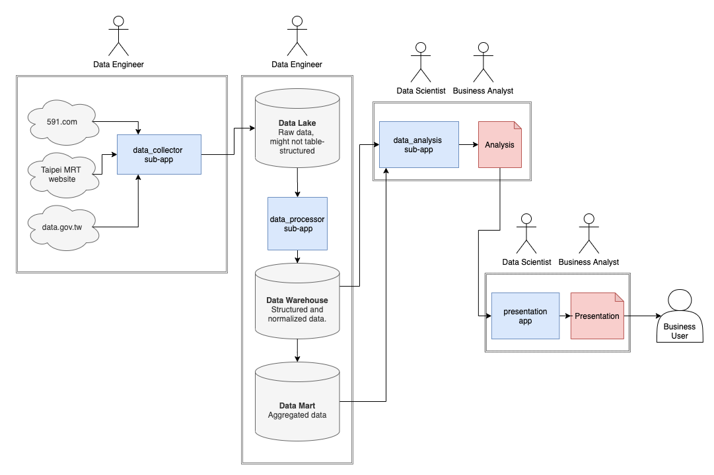

# Taipei food industry insight

## What is this?
A simplification of full data cycle, from raw data being gathered (web scrapping), processed (data pipeline), analyzed (statistic modeled), until presented (with data interactivity). The objective of this project is **to show how data being translated from one to another state and the stakeholders of the process.** Most part of the project are written in Python.
<br>
<br>

## Project structure, tech, and stakeholder
**The technology is chosen based on simplicity to be taught / debug*


The project structure, consist of:
- `data_collector` (Data Engineer) : web scrapping downloader script (Python, Bash - selenium, requests, beautifulsoup).
- `data_processor` (Data Engineer) : parsing, normalize, and geocoding (Python - multiprocessing, pandas, geopandas, shapely).
- `data_analysis` (Data Scientist / Business Analyst) : statistical simulation, aggregation, visualization (Python - dask, jupyter, plotly)
- `presentation` (Data Scientist / Business Analyst) : craft and tell the important data into understandable form (Python, Javascript, CSS - jupyter, reveal js, rise)

In this case there isn't, but in industry there area also this roles:
- `data tracking` (Data Engineer) : Design a robust and streamline data pipeline to get user activities.
- `dashboard` (Business Intelligence) : Make monitoring dashboard to help business user take decision quickly.
- `prediction model` (Data Scientist / ML Engineer) : Make a prediction model to solve business problem (could be predict the future / detect fraud / recommending item).
<br>
<br>

## Setup
**The project haven't been tested on windows.*

Recommended to use [Anaconda](https://www.anaconda.com/products/individual) for setup project environment, because there is a lot of non-python package. Create new environment using `requirement_conda.yml`. Here is how to setup the project folder, from clone to install the environment:
```
git clone https://github.com/curiouslaw/taipei_food_industry_insight
cd taipei_food_industry_insight
conda env create --file requirements_conda.yml --prefix ./conda-env
```
then to activate the environment, use this command. 
```
conda activate ./conda-env
```
To run below command, you need to use the environment (in env active state).

There might be some non-python package that would be used for some case. The lis is in file `unix_requirements.txt`. Please install with `apt-get` / other for linux or `brew` for mac.

## How to run the program
Some notes about the executable:

- Most of the command are located in `script` folder in the app and each sub-app. 
- There is some option in the python file / bash file (i.e. `python data_collector/scrape_taipei_shop_rent_price_main_data.py -o show` could let you see how the web crawler jump click from one website to another). This could be shown with the command `-h` on the code.
- you might need to set the execute permission. You could use `chmod 755 <filename>` for setting up the run.

Some important / interesting command might want to know:

- get the clean and granular data / data warehouse:
```
<project root dir>/script/execute_data_collector.sh
<project root dir>/script/execute_data_collector.sh
```
- get the raw data from the source (data lake):
```
<project root dir>/script/execute_data_collector.sh
```
- see how the a web scrapping work:
```
python <project root dir>/data_collector/scrape_taipei_shop_rent_price_main_data.py -o show
```
- auto download and extract script :
```
<project root dir>/data_collector/script/process_download_data.sh
```

## Other notes
Feel free to put github issue if any (question / suggestion  / etc).

I hope the project could help you in any way!